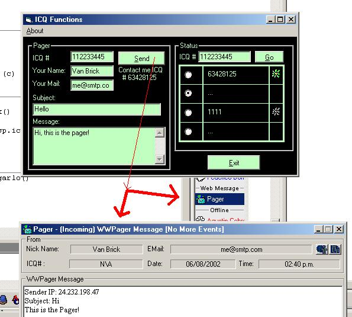



## ICQ multi\-function v\.0\.1

### Description

This is a multi program, that allows u ICQ PAGER and ICQ STATUS SHOW plus other things, soon i will add more stuff also for MSN

v.0.1.... vote me
 
### More Info
 

             |
---                |---
**Submitted On**   |2002-08-06 14:49:18
**By**             |[Van Brick](https://github.com/Planet-Source-Code/PSCIndex/blob/master/ByAuthor/van-brick.md)
**Level**          |Intermediate
**User Rating**    |5.0 (10 globes from 2 users)
**Compatibility**  |VB 6\.0
**Category**       |[Internet/ HTML](https://github.com/Planet-Source-Code/PSCIndex/blob/master/ByCategory/internet-html__1-34.md)
**World**          |[Visual Basic](https://github.com/Planet-Source-Code/PSCIndex/blob/master/ByWorld/visual-basic.md)
**Archive File**   |[ICQ\_multi\-115134862002\.zip](https://github.com/Planet-Source-Code/van-brick-icq-multi-function-v-0-1__1-37680/archive/master.zip)

